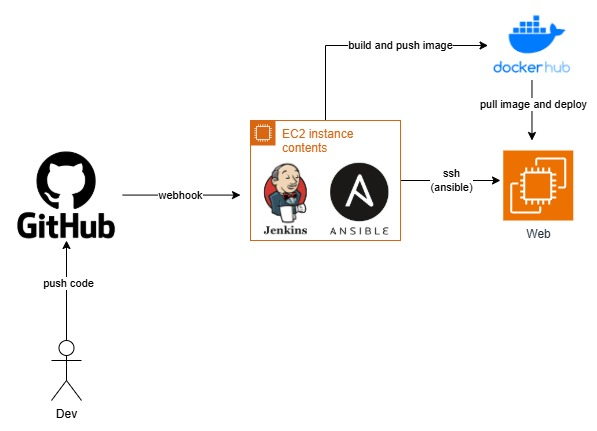

# Jenkins + Ansible CI/CD Project

A comprehensive CI/CD pipeline project demonstrating Jenkins + Ansible + Docker + Django integration.

## Architecture



**Two EC2 Instances Setup:**

1. **EC2 #1 (Jenkins + Ansible Server)**
   - Runs Jenkins for CI/CD pipeline
   - Runs Ansible control node for deployment
   - Builds and pushes Docker image to Docker Hub
   
2. **EC2 #2 (Web Server)**
   - Runs Django application in Docker container
   - Controlled by Ansible from EC2 #1
   - Serves the application on port 8000

**Pipeline Flow:**
1. **Developer** pushes code to GitHub
2. **GitHub** triggers webhook to Jenkins (EC2 #1)
3. **Jenkins** (EC2 #1) runs pipeline:
   - Checkout code from GitHub
   - Build Docker image
   - Push to Docker Hub
4. **Ansible** (EC2 #1) deploys to EC2 #2:
   - Pull Docker image from Docker Hub
   - Stop old container (if exists)
   - Run new container with latest image
5. **EC2 #2** runs Django application on port 8000

## Project Structure

```
jenkins-ansible-cicd/
├── Jenkinsfile                 # Jenkins pipeline definition
├── Dockerfile                  # Docker image for Django app
├── requirements.txt            # Python dependencies
├── README.md                   # This file
│
├── src/                        # Django application
│   ├── manage.py
│   ├── helloworld/             # Django project config
│   └── app/                    # Django app
│
├── ansible/                    # Ansible deployment
│   ├── inventory/
│   │   └── hosts.yml           # Server inventory
│   └── playbooks/
│       └── deploy.yml          # Deploy with Docker
│
└── images/                     # Documentation images
    └── cicd-pipeline.png       # CI/CD architecture diagram
```

## Quick Start

### Local Development

```bash
# Install dependencies
pip install -r requirements.txt

# Run Django server
cd src
python manage.py runserver
```

Access: http://localhost:8000/

### Build and Run Docker Image

```bash
docker build -t django-hello-world:latest .
docker run -p 8000:8000 django-hello-world:latest
```
Access: http://localhost:8000/

### Deploy with Ansible

```bash
# Edit inventory first
vim ansible/inventory/hosts.yml

# Run deployment
ansible-playbook -i ansible/inventory/hosts.yml ansible/playbooks/deploy.yml
```

## EC2 Setup Instructions

### EC2 #1 (Jenkins + Ansible Server)
For Jenkins installation reference : https://www.jenkins.io/doc/tutorials/tutorial-for-installing-jenkins-on-AWS/
For Docker installation reference : https://docs.aws.amazon.com/serverless-application-model/latest/developerguide/install-docker.html

```bash
# Update system
sudo yum update -y

# Add the Jenkins repo
sudo wget -O /etc/yum.repos.d/jenkins.repo https://pkg.jenkins.io/rpm-stable/jenkins.repo

# Import a key file from Jenkins-CI to enable installation from the package
sudo rpm --import https://pkg.jenkins.io/rpm-stable/jenkins.io-2026.key
sudo yum upgrade

# Install Java (required for Jenkins)
sudo yum install java-21-amazon-corretto -y

# Install Jenkins
sudo yum install jenkins -y

# Enable the Jenkins service to start at boot
sudo systemctl enable jenkins

# Start Jenkins as a service
sudo systemctl start jenkins

# Check Jenkins status
sudo systemctl status jenkins
```

```bash
# Install Ansible
sudo yum install ansible -y


# Install Docker
sudo yum install -y docker

# Start Docker
sudo service docker start
sudo usermod -a -G docker ec2-user
(Pick up the new docker group permissions by logging out and logging back in again. To do this, close your current SSH terminal window and reconnect to your instance in a new one. Your new SSH session should have the appropriate docker group permissions.)

# Verify that the ec2-user can run Docker commands without using sudo.
docker ps

You should see the following output, confirming that Docker is installed and running:
 CONTAINER ID        IMAGE               COMMAND             CREATED  
```


Access Jenkins at: `http://<EC2-1-IP-or-domain>:8080`

### EC2 #2 (Web Server - Django)

```bash
# Update system
sudo yum update -y

# Install Docker
sudo yum install -y docker

# Start Docker
sudo service docker start
sudo usermod -a -G docker ec2-user
(Pick up the new docker group permissions by logging out and logging back in again. To do this, close your current SSH terminal window and reconnect to your instance in a new one. Your new SSH session should have the appropriate docker group permissions.)

# Verify that the ec2-user can run Docker commands without using sudo.
docker ps

You should see the following output, confirming that Docker is installed and running:
 CONTAINER ID        IMAGE               COMMAND             CREATED 
```

**Ensure SSH Access:**
- EC2 #1 must be able to SSH to EC2 #2 without password
- Copy public key from EC2 #1 to EC2 #2:

#### Step 1: Generate SSH Key on EC2 #1

```bash
# On EC2 #1 (create ssh key for Ansible's connection to EC2 #2):
ssh-keygen -t rsa -N "" -f ~/.ssh/deploy-server

# Display public key (you'll need this)
cat ~/.ssh/deploy-server.pub
```

#### Step 2: Copy Public Key to EC2 #2
1. Get the public key content:
```bash
# On EC2 #1:
cat ~/.ssh/deploy-server.pub
```

2. Copy the output, then on EC2 #2 (via AWS Console EC2 Instance Connect):
```bash
# On EC2 #2:
mkdir -p ~/.ssh
chmod 700 ~/.ssh

# Paste the public key content below
echo "<paste-public-key-content-here>" >> ~/.ssh/authorized_keys
chmod 600 ~/.ssh/authorized_keys
```


## CI/CD Pipeline (Jenkins)

**Jenkins runs on EC2 #1** and orchestrates the deployment to EC2 #2.

The `Jenkinsfile` defines the pipeline with stages:

1. **Checkout** - Clone repository from GitHub
2. **Build Docker Image** - Build Django Docker image
3. **Push to Docker Hub** - Push image to Docker Hub registry
4. **Deploy with Ansible** - Deploy to EC2 #2 using Ansible

### Generate GitHub Token

**Recommended: Use Fine-grained Personal Access Token (more secure)**

1. Go to GitHub → **Settings** → **Developer settings** → **Personal access tokens** → **Fine-grained tokens**
2. Click **Generate new token**
3. **Token name**: `Jenkins access token`
4. **Expiration**: Select `90 days`
5. **Repository access**: Select **Only select repositories**
   - Choose your repository: `jenkins-ansible-cicd`
6. **Permissions** - **Repository permissions**:
   - **Contents**: `Read-only` (to clone code)
   - **Metadata**: `Read-only` (required)
7. Click **Generate token**
8. **Copy and save the token** (you won't be able to see it again)

### Generate Docker Hub Token

1. Go to Docker Hub → **Account Settings** → **Settings** → **Personal Access Tokens** → **Generate New Token**
2. **Access token description**: `Jenkins access token`
3. **Access permissions**: Select `Read & Write`
4. Click **Generate**
5. **Copy and save the token**

### Prerequisites for Jenkins

#### 1. Add jenkins user to docker group
```bash
# On EC2 #1:
sudo usermod -aG docker jenkins
sudo systemctl restart jenkins
```

#### 2. Add Docker Hub Credentials to Jenkins
1. Access Jenkins at `http://<EC2-1-IP-or-domain>:8080`
2. Go to **Manage Jenkins** → **Credentials**
3. Click on **(global)** → **Add Credentials**
4. Create Docker Hub credentials:
   - **Select a type of credential**: Username with password
   - **Scope**: Global
   - **Username**: `<your-docker-hub-username>`
   - **Password**: `<your-docker-hub-token>`
   - **ID**: `docker-hub-credentials`
   - Click **Create**

#### 3. Add GitHub Credentials to Jenkins (if private repo)
1. Go to **Manage Jenkins** → **Credentials**
2. Click on **(global)** → **Add Credentials**
3. Create GitHub credentials:
   - **Select a type of credential**: Username with password
   - **Scope**: Global
   - **Username**: `<your-github-username>`
   - **Password**: `<your-github-token>`
   - **ID**: `github-credentials`
   - Click **Create**

### Configure Disk Space Monitoring (Important!)

**Why is this important?**
- Jenkins monitors disk space and temporary space (`/tmp`) on the Jenkins node.
- If the available free space falls below the configured threshold, Jenkins will mark the node as **offline** and refuse to run any jobs.
- This can cause builds to be stuck with message: "Still waiting to schedule task" or "Waiting for next available executor".

#### Free Temp Space Threshold

**What is it?**
- `Free Temp Space Threshold` is the **minimum free space required** in the `/tmp` directory for Jenkins to operate properly.
- Default value: **1 GiB**.
- If free space drops below this threshold, Jenkins automatically takes the node offline.

**How to configure:**
1. Go to **Manage Jenkins** → **Manage Nodes and Clouds** → **Built-In Node**
2. Click **Configure** (gear icon)
3. Scroll down to **Disk Space Monitoring Thresholds**
4. In **Free Temp Space Threshold**, set an appropriate value:
   - **For small servers**: Set to `400 MiB` or `500 MiB`
   - **For medium servers**: Set to `1 GiB`
   - **For large servers**: Set to `2 GiB`
   - **To disable this check**: Set to `0`
   - **To use global default**: Leave empty

**Alternative: Use global setting**
- If you want all nodes to use the same threshold, leave the field **empty** and configure it globally at **Manage Jenkins** → **Configure System** → **Disk Space Monitoring Thresholds**.

**If you keep getting "disk space below threshold" errors:**
1. **Option 1**: Reduce the threshold value (e.g., from 1 GiB to 400 MiB).
2. **Option 2**: Increase the `/tmp` partition size on your server.
3. **Option 3**: Disable the check by setting the value to `0` (not recommended for production).

### Create Jenkins Pipeline Job

1. Access Jenkins at `http://<EC2-1-IP-or-domain>:8080`
2. Click **New Item**
3. **Item name**: `django-hello-world-pipeline`
4. **Type**: Select `Pipeline`
5. Click **OK**

#### Configure General Settings
- Tick ☑️ **GitHub project**
- **Project URL**: `https://github.com/your-username/jenkins-ansible-cicd`

#### Configure Build Triggers
- Tick ☑️ **GitHub hook trigger for GITScm polling**

#### Configure Pipeline
- **Definition**: `Pipeline script from SCM`
- **SCM**: `Git`
- **Repository URL**: `https://github.com/your-username/jenkins-ansible-cicd.git`
- **Credentials**: Select `github-credentials` (if private repo)
- **Branch**: `*/main`
- **Script Path**: `Jenkinsfile`
- **⚠️ IMPORTANT - Lightweight Checkout**: 
  - **DO NOT tick** "Lightweight checkout"
  - Why? We need the full source code to:
    - Build Docker image (requires Dockerfile)
    - Access all source files
    - Support Git changelog and polling
  - Leave it **unchecked** ✅

#### Click Save

### Configure GitHub Webhook

1. Go to GitHub repo → **Settings** → **Webhooks**
2. Click **Add webhook**
3. **Payload URL**: `http://<EC2-1-IP-or-domain>:8080/github-webhook/` (Note: The trailing slash / is required)
4. **Content type**: `application/json`
5. **Events**: Select **Push events**
6. Click **Add webhook**

Now, every push to the `main` branch will automatically trigger the Jenkins pipeline!

## Ansible Configuration

### Inventory

Edit [ansible/inventory/hosts.yml](ansible/inventory/hosts.yml) with your EC2 #2 server details:

```yaml
all:
  hosts:
    web_server:
      ansible_host: <EC2-2-IP-or-domain>
      ansible_user: ec2-user
      ansible_ssh_private_key_file: ~/.ssh/deploy-server
```

**Replace `<EC2-2-IP-or-domain>` with the actual IP address or domain name of EC2 #2**

### Playbook

The `deploy.yml` playbook handles:
- Pull Django Docker image
- Stop old container (if exists)
- Run new container with auto-restart on port 8000

## Requirements

- Python 3.9+
- Docker
- Ansible 2.9+
- Jenkins (for CI/CD)
- Git

## Environment Variables

Create `.env` file for sensitive data:

```bash
SECRET_KEY=your-secret-key
DEBUG=False
ALLOWED_HOSTS=your-domain.com
```